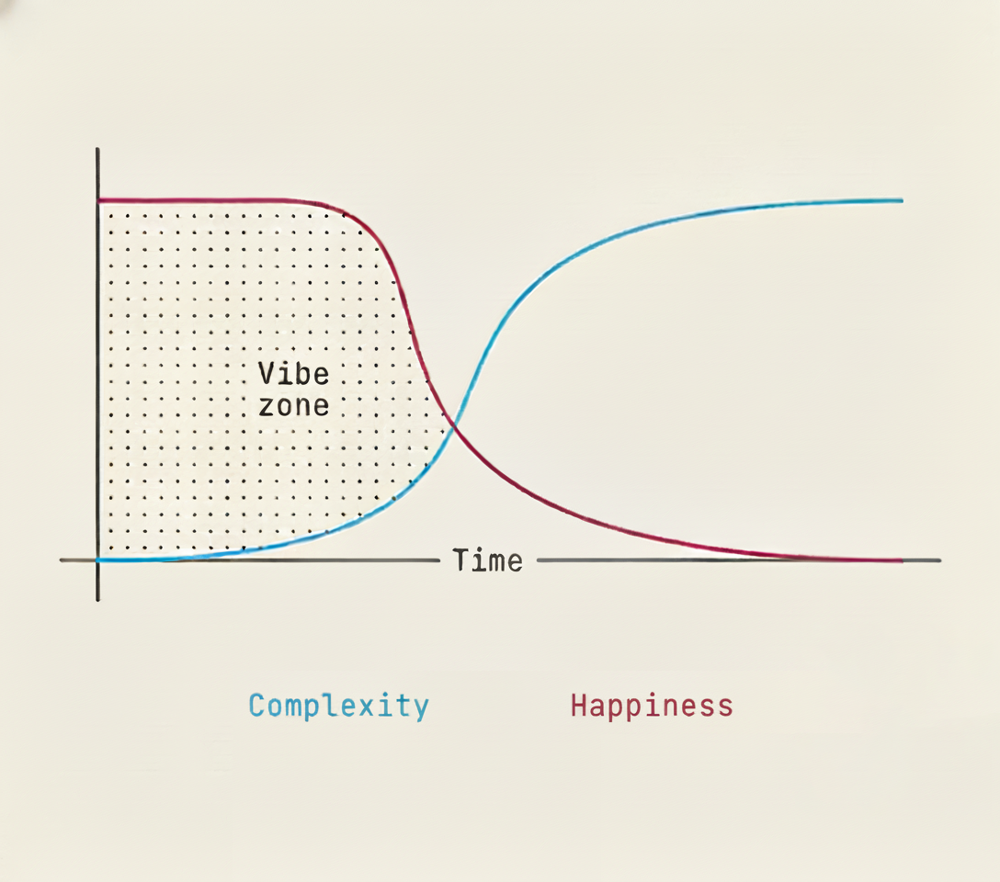

# Vibes - Claude Code Plugin


Instantly make your own small apps, without a backend. With Vibes, The front-end _is_ the app.

## What is Vibes DIY?

Vibes DIY is the vibe coding stack made for AI agents. It collapses application code and application state into a single HTML file that runs anywhere.

**Why does this matter?** AI doesn't make apps - it makes *text*. By embedding the database in JavaScript (via [Fireproof](https://fireproof.storage)), your coding agent can describe an entire app - including its persistence layer - in one shot. No server setup, no schema imports. Just a working app.

Your data lives locally in the browser, encrypted and portable. It syncs across users automatically. Share your creations with a simple link and friends can jump in immediately.

## Installation

```bash
/plugin marketplace add popmechanic/vibes-skill
/plugin install vibes@vibes-diy
```

**Important**: Restart Claude Code after installation to load the new skills.

## Skills

Skills are **model-invoked** - Claude automatically uses them when your task matches the skill's purpose. Just describe what you want to build.

### `vibes`

Generate a complete, working app from a prompt. Creates:
- Single HTML file with inline JavaScript (no build step)
- Fireproof for local-first database with real-time sync
- Tailwind CSS for styling
- Hidden settings menu for database sync configuration

**Example prompts:**
- "Make a chore chart for my roommates"
- "Build a potluck sign-up for Friendsgiving"
- "Create a trivia game about reality TV"
- "Make a vacation planner for the group"

### `riff`

Generate multiple app variations in parallel. Perfect for exploring different concepts from a loose prompt.

**Example prompt:** "Make me an app that could make money"

**Output:**
```
./
├── index.html          # Gallery showcasing all variations
├── RANKINGS.md         # Scored rankings with recommendations
├── riff-1/
│   ├── index.html      # App variation 1
│   └── BUSINESS.md     # Business model canvas
├── riff-2/
│   └── ...
```

Each riff is a genuinely different **concept**, not just aesthetic variations.

### `sell`

Transform any Vibes app into a multi-tenant SaaS with subdomain-based tenancy, authentication, and billing.

**What it adds:**
- Subdomain routing (alice.yourdomain.com, bob.yourdomain.com)
- Clerk authentication with sign-in/sign-up
- Clerk Billing for subscriptions
- Per-tenant Fireproof database isolation
- Marketing landing page with pricing
- Admin dashboard for tenant management

**Output:** A single unified `index.html` that handles all routes:
```
yourdomain.com          → Landing page with pricing
*.yourdomain.com        → Tenant app with auth gate
admin.yourdomain.com    → Admin dashboard
```

**Deployment:** Cloudflare Pages + Worker for wildcard subdomains. The skill includes step-by-step setup instructions for Clerk, DNS, and Cloudflare.

**Example flow:**
1. Build an app with `/vibes` (e.g., a photo sharing app)
2. Run `/sell` to transform it into a SaaS
3. Configure domain, pricing, Clerk keys
4. Deploy to Cloudflare and start selling

## Why Vibes?

Every vibe-coded project starts in the vibe zone - the AI understands you, progress is fast, each change moves the app forward.

Then something small goes wrong. A fix that mostly works. An edge case layered on top. You correct it, then correct the correction, and suddenly progress slows to a crawl.

You've drifted out of the vibe zone.



**Vibes DIY keeps things simple enough that you stay in the vibe zone.** Single-file apps. Local-first data. No server complexity. The AI can see and understand everything it needs to help you.

## Links

- [vibes.diy](https://vibes.diy) - Try the web builder
- [Discord](https://discord.gg/vnpWycj4Ta) - Join the community
- [GitHub](https://github.com/VibesDIY) - Open source
- [Substack](https://vibesdiy.substack.com/) - Updates and tutorials

## License

MIT
